# Task Management API

A sophisticated, enterprise-grade Task Management API, featuring advanced caching, authentication, authorization, and monitoring capabilities.

## Quick Start
### Automated Setup

```bash
git clone https://github.com/polarbeargo/Task-Management-API.git
cd Task-Management-API

./setup-scalable.sh

./run-dev.sh
```

API is now running at [http://localhost:8080](http://localhost:8080)

Details on configuration and environment variables can be found in the [SET_UP.md](SET_UP.md) file.

## System Architecture

### High-Level Architecture Overview

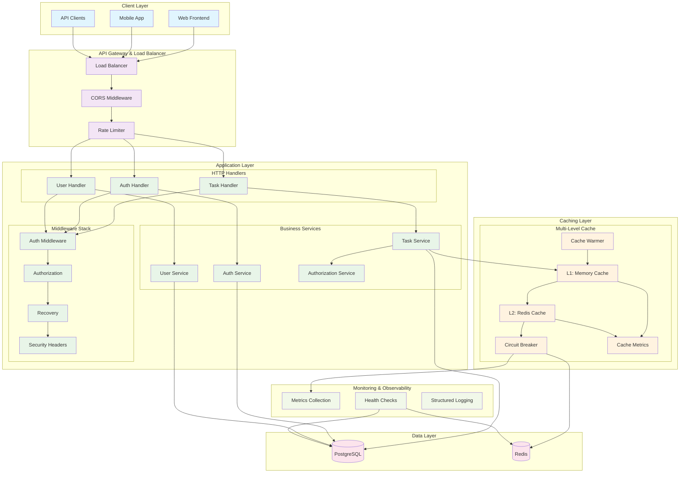

## Class Diagrams

### Core Domain Models

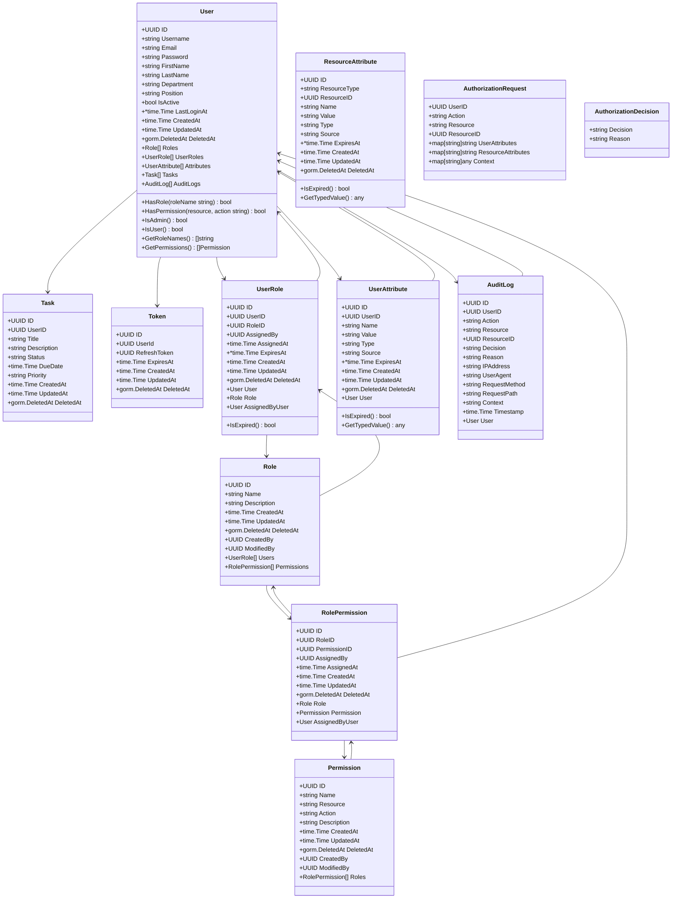

### Service Layer Architecture

```mermaid
classDiagram
    class TaskService {
        <<interface>>
        +CreateTask(db *gorm.DB, task models.Task) error
        +GetTaskByID(db *gorm.DB, id uuid.UUID) (models.Task, error)
        +GetTasks(db *gorm.DB) ([]models.Task, error)
        +UpdateTask(db *gorm.DB, id uuid.UUID, updated models.Task) error
        +DeleteTask(db *gorm.DB, id uuid.UUID) error
        +GetTasksPaginated(db *gorm.DB, sortBy, order, page, pageSize string) ([]models.Task, int64, error)
    }

    class TaskServiceImpl {
        +CreateTask(db *gorm.DB, task models.Task) error
        +GetTaskByID(db *gorm.DB, id uuid.UUID) (models.Task, error)
        +GetTasks(db *gorm.DB) ([]models.Task, error)
        +UpdateTask(db *gorm.DB, id uuid.UUID, updated models.Task) error
        +DeleteTask(db *gorm.DB, id uuid.UUID) error
        +GetTasksPaginated(db *gorm.DB, sortBy, order, page, pageSize string) ([]models.Task, int64, error)
    }

    class CachedTaskService {
        -taskService TaskService
        -cache *MultiLevelCache
        -warmingActive bool
        +CreateTask(db *gorm.DB, task models.Task) error
        +GetTaskByID(db *gorm.DB, id uuid.UUID) (models.Task, error)
        +GetTasks(db *gorm.DB) ([]models.Task, error)
        +UpdateTask(db *gorm.DB, id uuid.UUID, updated models.Task) error
        +DeleteTask(db *gorm.DB, id uuid.UUID) error
        +GetTasksPaginated(db *gorm.DB, sortBy, order, page, pageSize string) ([]models.Task, int64, error)
        +GetTasksByUser(db *gorm.DB, userID uuid.UUID) ([]models.Task, error)
        +GetCacheStats() map[string]any
        +StartCacheWarming(ctx context.Context)
        +StopCacheWarming()
        +WarmCriticalData(ctx context.Context, db *gorm.DB) error
        -setupCacheWarming()
    }

    class AuthService {
        <<interface>>
        +LoginUser(db *gorm.DB, email, password string) (*models.User, error)
        +GenerateToken(db *gorm.DB, userID uuid.UUID) (string, string, error)
        +RefreshToken(db *gorm.DB, refreshToken string) (string, string, int64, error)
        +GetUserPermissions(db *gorm.DB, userID uuid.UUID) ([]string, error)
        +RevokeToken(db *gorm.DB, refreshToken string) error
    }

    class AuthServiceImpl {
        +LoginUser(db *gorm.DB, email, password string) (*models.User, error)
        +GenerateToken(db *gorm.DB, userID uuid.UUID) (string, string, error)
        +RefreshToken(db *gorm.DB, refreshToken string) (string, string, int64, error)
        +GetUserPermissions(db *gorm.DB, userID uuid.UUID) ([]string, error)
        +RevokeToken(db *gorm.DB, refreshToken string) error
    }

    class UserService {
        <<interface>>
        +GetUserProfile(db *gorm.DB, userID uuid.UUID) (models.User, error)
        +GetUserProfileMalicious(db *gorm.DB, userID string) ([]models.User, error)
        +GetUsers(db *gorm.DB) ([]models.User, error)
        +DeleteUser(db *gorm.DB, userId uuid.UUID) error
    }

    class UserServiceImpl {
        +GetUserProfile(db *gorm.DB, userID uuid.UUID) (models.User, error)
        +GetUserProfileMalicious(db *gorm.DB, userID string) ([]models.User, error)
        +GetUsers(db *gorm.DB) ([]models.User, error)
        +DeleteUser(db *gorm.DB, userId uuid.UUID) error
    }

    class RegisterService {
        <<interface>>
        +RegisterUser(db *gorm.DB, req RegistrationRequest) (*models.User, error)
    }

    class RegisterServiceImpl {
        +RegisterUser(db *gorm.DB, req RegistrationRequest) (*models.User, error)
    }

    class AuthorizationService {
        <<interface>>
        +HasRole(ctx context.Context, userID uuid.UUID, roleName string) (bool, error)
        +HasPermission(ctx context.Context, userID uuid.UUID, resource, action string) (bool, error)
        +AssignRole(ctx context.Context, userID, roleID, assignedBy uuid.UUID) error
        +RevokeRole(ctx context.Context, userID, roleID uuid.UUID) error
        +IsAuthorized(ctx context.Context, request AuthorizationRequest) (*AuthorizationDecision, error)
        +SetUserAttribute(ctx context.Context, userID uuid.UUID, key, value, dataType string) error
        +SetResourceAttribute(ctx context.Context, resourceType string, resourceID uuid.UUID, key, value, dataType string) error
        +CreateRole(ctx context.Context, name, description string) (*models.Role, error)
        +CreatePermission(ctx context.Context, resource, action, description string) (*models.Permission, error)
        +GrantPermissionToRole(ctx context.Context, roleID, permissionID, grantedBy uuid.UUID) error
        +LogAuthorizationDecision(ctx context.Context, decision AuthorizationDecision) error
    }

    class AuthorizationServiceImpl {
        -db *gorm.DB
        +HasRole(ctx context.Context, userID uuid.UUID, roleName string) (bool, error)
        +HasPermission(ctx context.Context, userID uuid.UUID, resource, action string) (bool, error)
        +AssignRole(ctx context.Context, userID, roleID, assignedBy uuid.UUID) error
        +RevokeRole(ctx context.Context, userID, roleID uuid.UUID) error
        +IsAuthorized(ctx context.Context, request AuthorizationRequest) (*AuthorizationDecision, error)
        +SetUserAttribute(ctx context.Context, userID uuid.UUID, key, value, dataType string) error
        +SetResourceAttribute(ctx context.Context, resourceType string, resourceID uuid.UUID, key, value, dataType string) error
        +CreateRole(ctx context.Context, name, description string) (*models.Role, error)
        +CreatePermission(ctx context.Context, resource, action, description string) (*models.Permission, error)
        +GrantPermissionToRole(ctx context.Context, roleID, permissionID, grantedBy uuid.UUID) error
        +LogAuthorizationDecision(ctx context.Context, decision AuthorizationDecision) error
        -evaluateABACPolicies(ctx context.Context, request AuthorizationRequest) (bool, string, error)
        -evaluateTaskABACPolicy(ctx context.Context, request AuthorizationRequest, userAttrs map[string]string) (bool, string, error)
        -evaluateUserABACPolicy(ctx context.Context, request AuthorizationRequest, userAttrs map[string]string) (bool, string, error)
    }

    %% Relationships
    TaskService <|-- TaskServiceImpl : implements
    TaskService <|-- CachedTaskService : implements
    AuthService <|-- AuthServiceImpl : implements
    UserService <|-- UserServiceImpl : implements
    RegisterService <|-- RegisterServiceImpl : implements
    AuthorizationService <|-- AuthorizationServiceImpl : implements
    
    CachedTaskService --> TaskServiceImpl : decorates
    CachedTaskService --> MultiLevelCache : uses

    %% Styling
    classDef interfaceClass fill:#f3e5f5,stroke:#4a148c,stroke-width:2px
    classDef serviceClass fill:#e8f5e8,stroke:#1b5e20,stroke-width:2px
    classDef decoratorClass fill:#fff3e0,stroke:#e65100,stroke-width:2px

```

### Multi-Level Caching System

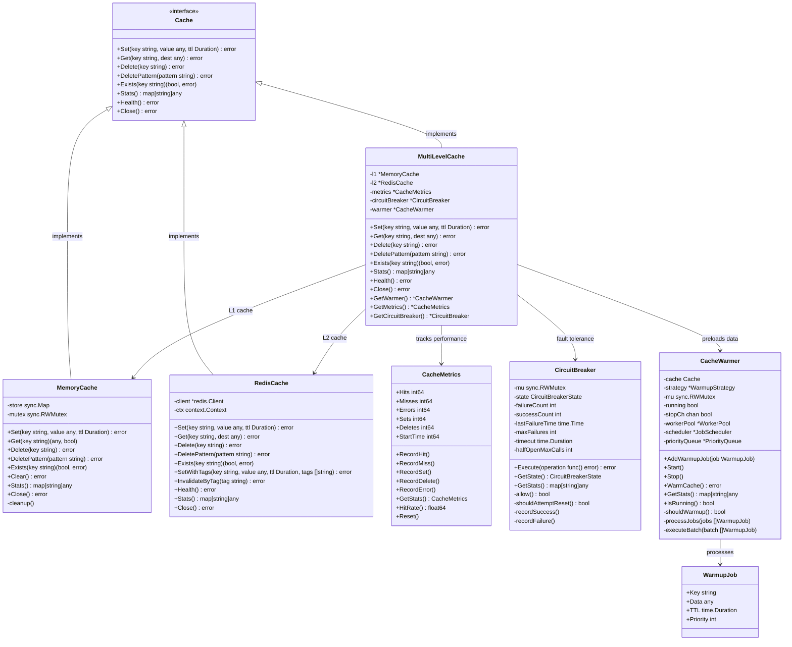
## Cache Warming Job/Worker System

```mermaid
classDiagram
    class UnifiedCacheManager {
        -IntegratedCacheWarmer* integratedWarmer
        -CacheWarmer* legacyWarmer
        -bool useIntegrated
        -context.Context ctx
        +NewUnifiedCacheManager(cache Cache, config *CacheWarmingConfig) *UnifiedCacheManager
        +Start() error
        +Stop() error
        +IsRunning() bool
        +IsIntegrated() bool
        +WarmupCache() error
        +EnqueueWarmupJob(key string, data any, ttl Duration, priority int) error
        +EnqueueBatchWarmupJob(keys []string, data any, priority int) error
        +EnqueueScheduledWarmup(key string, data any, ttl Duration, processAt Time, priority int) error
        +EnqueueEvictionJob(key string, priority int) error
        +EnqueueValidationJob(key string, expectedData any, priority int) error
        +GetMetrics() map[string]any
        +GetQueueSizes() (map[string]int64, error)
        +GetSystemInfo() map[string]any
        +HealthCheck() map[string]any
        +WarmupUserData(userID string, userData any, ttl Duration) error
        +WarmupBatchUserData(userIDs []string, userDataMap map[string]any, ttl Duration) error
        +WarmupPopularContent(contentType string, items []any, ttl Duration) error
        +UpdateConfiguration(newStrategy *WarmupStrategy) error
        +SchedulePeriodicWarmup(key string, data any, ttl Duration, interval Duration) error
        -determineMode(config *CacheWarmingConfig, cache Cache) CacheWarmingMode
    }

    class IntegratedCacheWarmer {
        -Cache cache
        -*redis.Client redisClient
        -*WarmupStrategy strategy
        -sync.RWMutex mu
        -bool running
        -chan stopCh
        -[]*DistributedCacheWorker distributedWorkers
        -*WorkerPool localWorkerPool
        -*JobRouter jobRouter
        -*JobScheduler scheduler
        -*PriorityQueue priorityQueue
        -int64 processedJobs
        -int64 failedJobs
        -int64 retryJobs
        -int64 distributedJobs
        -int64 localJobs
        +NewIntegratedCacheWarmer(cache Cache, redisClient *redis.Client, strategy *WarmupStrategy) *IntegratedCacheWarmer
        +Start() error
        +Stop() error
        +EnqueueWarmupJob(key string, data any, ttl Duration, priority int) error
        +EnqueueBatchWarmupJob(keys []string, data any, priority int) error
        +EnqueueScheduledWarmup(key string, data any, ttl Duration, processAt Time, priority int) error
        +GetMetrics() map[string]any
        +GetQueueSizes() (map[string]int64, error)
        +WarmupCache() error
        +IsRunning() bool
        +routeJob(job DistributedCacheJob) error
        -enqueueToRedis(job DistributedCacheJob) error
        -enqueueToLocal(job DistributedCacheJob) error
    }

    class CacheWarmer {
        -Cache cache
        -*WarmupStrategy strategy
        -sync.RWMutex mu
        -bool running
        -chan stopCh
        -*WorkerPool workerPool
        -*JobScheduler scheduler
        -*PriorityQueue priorityQueue
        +NewCacheWarmer(cache Cache, strategy *WarmupStrategy) *CacheWarmer
        +AddWarmupJob(job WarmupJob)
        +Start(ctx Context)
        +Stop()
        +WarmCacheManually(ctx Context)
        +GetStats() map[string]any
        -warmCache(ctx Context) error
        -processBatch(ctx Context, jobs []WarmupJob, concurrency int) error
        -processJob(job WarmupJob) error
        -shouldWarmup() bool
    }

    class DistributedCacheWorker {
        -string id
        -*IntegratedCacheWarmer warmer
        -*redis.Client redisClient
        -chan stopCh
        -sync.WaitGroup wg
        -string queueName
        +start()
        -processJobs()
        -moveDelayedJobs(ctx Context)
        -processImmediateJobs(ctx Context)
        -executeJob(ctx Context, job *DistributedCacheJob)
        -handleWarmupJob(ctx Context, job *DistributedCacheJob) error
        -handleBatchJob(ctx Context, job *DistributedCacheJob) error
        -handleValidationJob(ctx Context, job *DistributedCacheJob) error
        -handleEvictionJob(ctx Context, job *DistributedCacheJob) error
    }

    class WorkerPool {
        -int workers
        -chan WarmupJob jobCh
        -chan JobResult resultCh
        -Cache cache
        -context.Context ctx
        -context.CancelFunc cancel
        -sync.WaitGroup wg
        -bool running
        -sync.RWMutex mu
        -int64 jobsProcessed
        -time.Duration totalDuration
        -int64 errors
        +NewWorkerPool(workers int, cache Cache) *WorkerPool
        +Start()
        +Stop()
        +SubmitJob(job WarmupJob) bool
        +SubmitJobs(jobs []WarmupJob) int
        +GetStats() map[string]any
        +IsRunning() bool
        +Resize(newSize int)
        -worker(id int)
        -processJob(job WarmupJob) JobResult
        -resultCollector()
    }

    class JobRouter {
        -bool redisAvailable
        -int localCapacity
        -string distributedQueue
        -sync.RWMutex mu
    }

    class JobScheduler {
        -*CacheWarmer warmer
        -*WorkerPool workerPool
        -*PriorityQueue queue
        -map[string]*ScheduleTrigger triggers
        -bool running
        -context.Context ctx
        -context.CancelFunc cancel
        -sync.RWMutex mu
        -time.Time lastRun
        -time.Time nextRun
        -int64 runCount
        +NewJobScheduler(warmer *CacheWarmer, workerPool *WorkerPool) *JobScheduler
        +AddIntervalTrigger(name string, interval Duration, condition func() bool)
        +AddEventTrigger(name string, condition func() bool)
        +RemoveTrigger(name string)
        +ScheduleJob(job WarmupJob)
        +ScheduleJobs(jobs []WarmupJob)
        +Start()
        +Stop()
        +ProcessScheduledJobs() int
        +GetStats() map[string]any
        +IsRunning() bool
        +ClearQueue()
        -schedulerLoop()
        -checkTriggers()
        -extractJobsBatch() []WarmupJob
    }

    class PriorityQueue {
        -[]*JobQueue items
        -sync.RWMutex mu
        +NewPriorityQueue() *PriorityQueue
        +Push(job WarmupJob)
        +Pop() (WarmupJob, bool)
        +Peek() (WarmupJob, bool)
        +Len() int
        +Empty() bool
        +Clear()
        +GetJobs() []WarmupJob
    }

    class WarmupJob {
        +string Key
        +any Data
        +time.Duration TTL
        +int Priority
    }

    class DistributedCacheJob {
        +string ID
        +CacheJobType Type
        +map[string]any Payload
        +int Attempts
        +int MaxTries
        +time.Time CreatedAt
        +time.Time ProcessAt
        +int Priority
    }

    class WarmupStrategy {
        +[]WarmupJob Jobs
        +int BatchSize
        +int ConcurrentJobs
        +time.Duration WarmupInterval
        +func() bool HealthCheckFunc
        +bool UseWorkerPool
        +bool UseScheduler
    }

    class CacheWarmingConfig {
        +CacheWarmingMode Mode
        +*redis.Client RedisClient
        +*WarmupStrategy Strategy
        +bool EnableMetrics
        +bool PreferDistributed
        +bool LocalFallback
        +int DistributedThreshold
        +int MaxRetries
    }

    class JobQueue {
        +WarmupJob Job
        +int Priority
        +int Index
    }

    class JobResult {
        +WarmupJob Job
        +error Error
        +time.Duration Duration
    }

    class ScheduleTrigger {
        +string Type
        +time.Duration Interval
        +func() bool Condition
    }

    class PriorityQueueHeap {
        <<interface>>
        +Len() int
        +Less(i, j int) bool
        +Swap(i, j int)
        +Push(x any)
        +Pop() any
    }

    %% Enums and Constants
    class CacheJobType {
        <<enumeration>>
        CacheJobWarmup
        CacheJobBatch
        CacheJobEviction
        CacheJobValidation
        CacheJobScheduled
    }

    class CacheWarmingMode {
        <<enumeration>>
        ModeAuto
        ModeLegacy
        ModeIntegrated
        ModeLocalOnly
        ModeDistributed
    }

    %% Relationships
    UnifiedCacheManager --> IntegratedCacheWarmer : manages (integrated mode)
    UnifiedCacheManager --> CacheWarmer : manages (legacy mode)
    UnifiedCacheManager --> CacheWarmingConfig : configured by
    
    IntegratedCacheWarmer --> DistributedCacheWorker : contains multiple
    IntegratedCacheWarmer --> WorkerPool : uses (local processing)
    IntegratedCacheWarmer --> JobRouter : routes jobs with
    IntegratedCacheWarmer --> JobScheduler : schedules with
    IntegratedCacheWarmer --> PriorityQueue : queues jobs in
    IntegratedCacheWarmer --> WarmupStrategy : configured by
    IntegratedCacheWarmer --> DistributedCacheJob : processes
    
    CacheWarmer --> WorkerPool : manages
    CacheWarmer --> JobScheduler : coordinates
    CacheWarmer --> PriorityQueue : queues jobs
    CacheWarmer --> WarmupStrategy : uses
    CacheWarmer --> WarmupJob : processes
    
    DistributedCacheWorker --> DistributedCacheJob : processes
    DistributedCacheWorker --> IntegratedCacheWarmer : reports to
    
    WorkerPool --> WarmupJob : processes
    WorkerPool --> JobResult : produces
    
    JobScheduler --> ScheduleTrigger : uses
    JobScheduler --> CacheWarmer : triggers
    JobScheduler --> WorkerPool : submits to
    JobScheduler --> PriorityQueue : manages
    
    PriorityQueue --> JobQueue : contains
    PriorityQueue --> WarmupJob : stores
    PriorityQueueHeap --> JobQueue : heap operations
    
    JobQueue --> WarmupJob : wraps
    WarmupStrategy --> WarmupJob : contains
    DistributedCacheJob --> CacheJobType : typed by
    CacheWarmingConfig --> CacheWarmingMode : configured by

    %% Styling
    classDef managerClass fill:#e1f5fe,stroke:#03a9f4,stroke-width:2px
    classDef workerClass fill:#fff3e0,stroke:#ff9800,stroke-width:2px
    classDef jobClass fill:#e8f5e8,stroke:#4caf50,stroke-width:2px
    classDef componentClass fill:#f3e5f5,stroke:#9c27b0,stroke-width:2px
    classDef configClass fill:#fce4ec,stroke:#e91e63,stroke-width:2px
    classDef interfaceClass fill:#fff8e1,stroke:#ffc107,stroke-width:2px
    classDef enumClass fill:#f1f8e9,stroke:#8bc34a,stroke-width:2px
    
``` 

## Sequence Diagrams

### Task Creation Flow with Caching

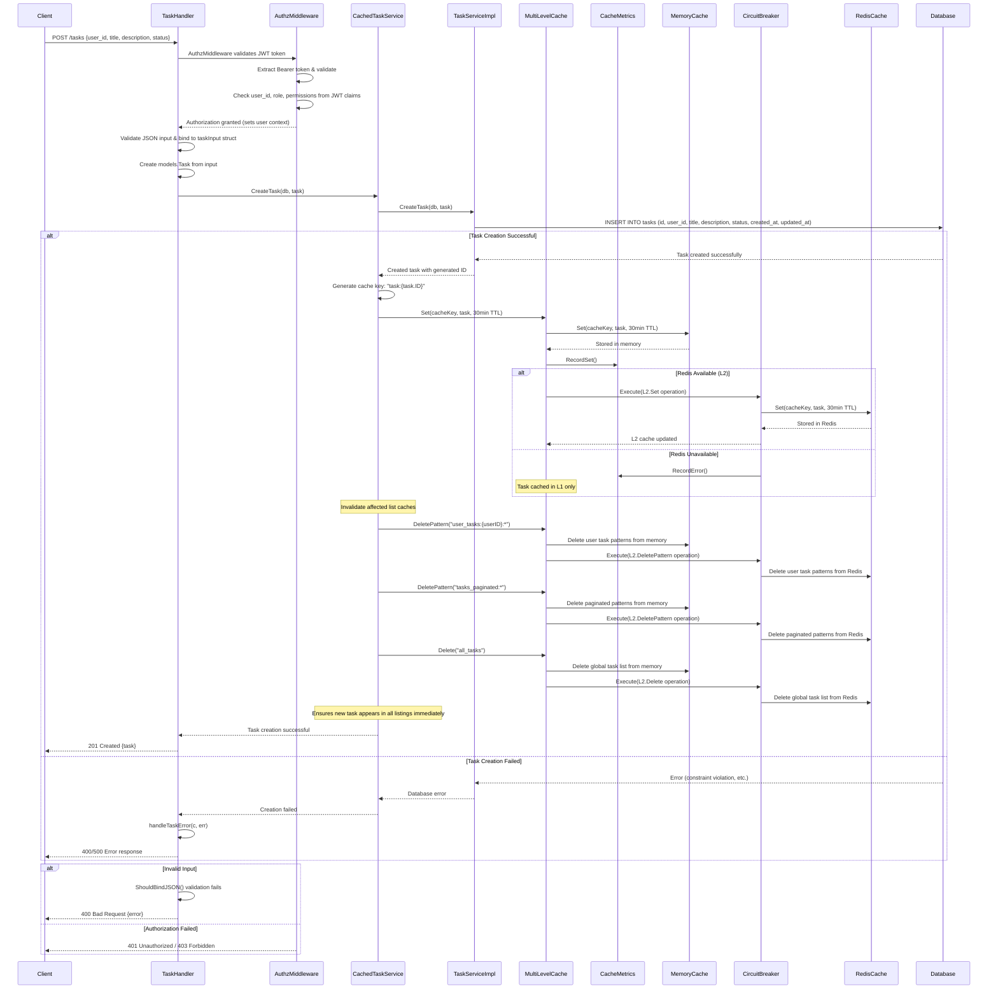

### Task Retrieval with Multi-Level Cache

```mermaid
sequenceDiagram
    participant C as Client
    participant H as TaskHandler
    participant CS as CachedTaskService
    participant MC as MultiLevelCache
    participant M as CacheMetrics
    participant L1 as MemoryCache
    participant CB as CircuitBreaker
    participant L2 as RedisCache
    participant TS as TaskServiceImpl
    participant DB as Database

    C->>H: GET /tasks/:id
    H->>CS: GetTaskByID(db, id)
    
    CS->>CS: Generate cache key: "task:{id}"
    CS->>MC: Get(cacheKey, &cachedTask)
    
    %% L1 Cache Check
    MC->>L1: Get(cacheKey)
    
    alt Cache Hit (L1 Memory)
        L1-->>MC: Task found in memory
        MC->>M: RecordHit()
        MC->>MC: copyValue(task, &cachedTask) via JSON
        MC-->>CS: Task from L1 memory
        CS-->>H: Cached task (30min TTL)
        H-->>C: 200 OK with task
        
    else Cache Miss (L1 Memory)
        L1-->>MC: Not found in memory
        
        alt L2 Redis Available
            MC->>CB: Execute(L2.Get operation)
            
            alt Circuit Breaker CLOSED
                CB->>L2: Get(cacheKey, &task)
                
                alt Cache Hit (L2 Redis)
                    L2-->>CB: Task found in Redis
                    CB-->>MC: Task from L2 Redis
                    MC->>L1: Set(cacheKey, task, 5min TTL)
                    MC->>M: RecordHit()
                    MC-->>CS: Task from L2 Redis
                    CS-->>H: Cached task
                    H-->>C: 200 OK with task
                    
                else Cache Miss (L2 Redis)
                    L2-->>CB: Not found in Redis
                    CB-->>MC: Not found
                    MC->>M: RecordMiss()
                    
                    %% Database Fallback
                    CS->>TS: GetTaskByID(db, id)
                    TS->>DB: SELECT * FROM tasks WHERE id = ?
                    
                    alt Task Found in DB
                        DB-->>TS: Task record
                        TS-->>CS: Fresh task from DB
                        
                        %% Cache the result
                        CS->>MC: Set(cacheKey, task, 30min TTL)
                        MC->>L1: Set(cacheKey, task, 30min TTL)
                        MC->>M: RecordSet()
                        
                        alt Redis Set via Circuit Breaker
                            MC->>CB: Execute(L2.Set operation)
                            CB->>L2: Set(cacheKey, task, 30min TTL)
                            L2-->>CB: Set successful
                            CB-->>MC: Redis cache updated
                        else Redis Set Failed
                            CB->>CB: Record failure
                            MC->>M: RecordError()
                            note over CB: Circuit breaker may open if failures exceed threshold
                        end
                        
                        CS-->>H: Fresh task
                        H-->>C: 200 OK with task
                        
                    else Task Not Found in DB
                        DB-->>TS: Error (record not found)
                        TS-->>CS: Error
                        CS-->>H: Error
                        H-->>C: 404 Not Found
                    end
                end
                
            else Circuit Breaker OPEN/HALF-OPEN
                CB-->>MC: Circuit breaker prevents Redis call
                MC->>M: RecordMiss()
                note over CB: Redis temporarily unavailable
                
                %% Skip Redis, go directly to DB
                CS->>TS: GetTaskByID(db, id)
                TS->>DB: SELECT * FROM tasks WHERE id = ?
                DB-->>TS: Task record
                TS-->>CS: Fresh task from DB
                
                CS->>MC: Set(cacheKey, task, 30min TTL)
                MC->>L1: Set(cacheKey, task, 30min TTL)
                note over MC: Only cache in L1 when Redis is down
                
                CS-->>H: Fresh task
                H-->>C: 200 OK with task
            end
            
        else No Redis (L2 Cache Unavailable)
            MC->>M: RecordMiss()
            
            %% Direct to Database
            CS->>TS: GetTaskByID(db, id)
            TS->>DB: SELECT * FROM tasks WHERE id = ?
            DB-->>TS: Task record
            TS-->>CS: Fresh task from DB
            
            CS->>MC: Set(cacheKey, task, 30min TTL)
            MC->>L1: Set(cacheKey, task, 30min TTL)
            
            CS-->>H: Fresh task
            H-->>C: 200 OK with task
        end
    end

    %% Cache Invalidation (on Update/Delete)
    note over CS: Cache Invalidation Strategy
    C->>H: PUT /tasks/:id (update task)
    H->>CS: UpdateTask(db, id, updated)
    CS->>TS: UpdateTask(db, id, updated)
    TS->>DB: UPDATE tasks SET ... WHERE id = ?
    
    %% Invalidate specific task cache
    CS->>MC: Delete("task:{id}")
    MC->>L1: Delete("task:{id}")
    MC->>CB: Execute(L2.Delete operation)
    CB->>L2: Delete("task:{id}")
    
    %% Invalidate related caches
    CS->>MC: DeletePattern("user_tasks:{userID}:*")
    CS->>MC: DeletePattern("tasks_paginated:*")
    CS->>MC: Delete("all_tasks")
    
    CS-->>H: Update successful
    H-->>C: 200 OK

    %% Cache Management (on Create)
    note over CS: Create Task with Cache Management
    C->>H: POST /tasks (create task)
    H->>CS: CreateTask(db, task)
    CS->>TS: CreateTask(db, task)
    TS->>DB: INSERT INTO tasks ...
    DB-->>TS: Task created
    TS-->>CS: Created task
    
    %% Cache the new task immediately
    CS->>MC: Set("task:{id}", task, 30min TTL)
    MC->>L1: Set("task:{id}", task, 30min TTL)
    MC->>M: RecordSet()
    
    alt Redis Available
        MC->>CB: Execute(L2.Set operation)
        CB->>L2: Set("task:{id}", task, 30min TTL)
        L2-->>CB: Set successful
        CB-->>MC: Redis cache updated
    else Redis Unavailable
        note over MC: Only cached in L1 memory
    end
    
    %% Invalidate related list caches (FIXED)
    CS->>MC: DeletePattern("user_tasks:{userID}:*")
    CS->>MC: DeletePattern("tasks_paginated:*")
    CS->>MC: Delete("all_tasks")
    note over CS: Ensures new task appears in all listings
    
    CS-->>H: Create successful
    H-->>C: 201 Created with task

    %% Cache Invalidation (on Delete)
    note over CS: Delete Task with Cache Cleanup
    C->>H: DELETE /tasks/:id
    H->>CS: DeleteTask(db, id)
    CS->>TS: GetTaskByID(db, id) for userID
    TS->>DB: SELECT * FROM tasks WHERE id = ?
    DB-->>TS: Task details (for cleanup)
    TS-->>CS: Task info
    
    CS->>TS: DeleteTask(db, id)
    TS->>DB: DELETE FROM tasks WHERE id = ?
    DB-->>TS: Task deleted
    TS-->>CS: Delete successful
    
    %% Complete cache cleanup
    CS->>MC: Delete("task:{id}")
    MC->>L1: Delete("task:{id}")
    MC->>CB: Execute(L2.Delete operation)
    CB->>L2: Delete("task:{id}")
    
    CS->>MC: DeletePattern("user_tasks:{userID}:*")
    CS->>MC: DeletePattern("tasks_paginated:*")
    CS->>MC: Delete("all_tasks")
    
    CS-->>H: Delete successful
    H-->>C: 204 No Content
```

### Authentication & Authorization Flow

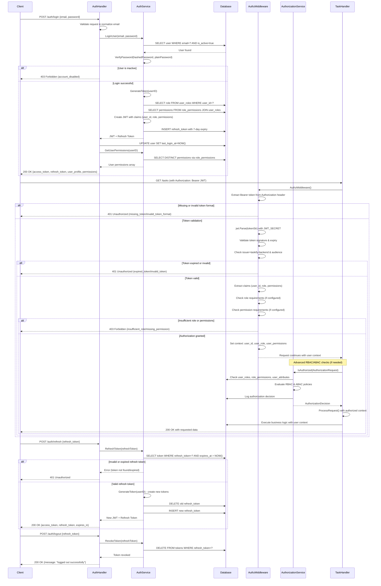

### Job/Worker Sequence Flow

```mermaid
sequenceDiagram
    participant C as Client/Application
    participant UCM as UnifiedCacheManager
    participant ICW as IntegratedCacheWarmer
    participant JR as JobRouter
    participant DCW as DistributedCacheWorker
    participant WP as WorkerPool
    participant W as Worker Goroutine
    participant RC as ResultCollector
    participant JS as JobScheduler
    participant PQ as PriorityQueue
    participant Redis as Redis Queue
    participant Cache as Cache

    %% Initialization Phase
    C->>UCM: NewUnifiedCacheManager(cache, config)
    UCM->>UCM: determineMode(config)
    
    alt Integrated Mode (Redis Available)
        UCM->>ICW: NewIntegratedCacheWarmer(cache, redisClient, strategy)
        ICW->>JR: Initialize JobRouter with Redis availability
        ICW->>WP: NewWorkerPool(workers, cache)
        ICW->>JS: NewJobScheduler(warmer, workerPool)
        ICW->>PQ: NewPriorityQueue()
        
        loop For each distributed worker
            ICW->>DCW: Create DistributedCacheWorker
        end
    else Legacy Mode (Redis Unavailable)
        UCM->>CW: NewCacheWarmer(cache, strategy)
        note over UCM: Falls back to legacy in-memory system
    end

    %% Startup Phase
    C->>UCM: Start()
    UCM->>ICW: Start()
    
    ICW->>WP: Start()
    loop Worker Initialization
        WP->>W: Start worker(id) goroutine
        W->>W: Listen on jobCh channel
        note over W: Worker waits for jobs
    end
    
    WP->>RC: Start resultCollector() goroutine
    note over RC: Collects job results and updates metrics
    
    loop For each distributed worker
        ICW->>DCW: start()
        DCW->>DCW: Start polling loop
        note over DCW: Polls Redis queues every 100ms
    end
    
    ICW->>JS: Start()
    JS->>JS: Start schedulerLoop()

    %% Job Enqueue Phase
    C->>UCM: EnqueueWarmupJob(key, data, ttl, priority)
    UCM->>ICW: EnqueueWarmupJob(key, data, ttl, priority)
    ICW->>ICW: Create DistributedCacheJob
    ICW->>JR: routeJob(job)
    
    alt High Priority Job (priority == 1)
        JR->>ICW: Route to local processing
        ICW->>ICW: Convert to WarmupJob format
        ICW->>WP: SubmitJob(warmupJob)
        WP->>W: Send job via jobCh
        W->>W: processJob(job)
        W->>Cache: Set(key, data, TTL)
        Cache-->>W: Success/Error
        W->>RC: Send JobResult via resultCh
        RC->>WP: Update metrics (jobsProcessed, errors)
    else Local Queue Full
        JR->>ICW: Route to distributed processing
        ICW->>Redis: ZAdd(cache_jobs, prioritizedJob)
        Redis-->>ICW: Job queued
    else Normal Priority Job
        JR->>ICW: Route to distributed processing
        ICW->>Redis: ZAdd(cache_jobs, prioritizedJob)
        Redis-->>ICW: Job queued
        
        %% Distributed Processing Loop
        loop Distributed Worker Polling
            DCW->>DCW: moveDelayedJobs() - Check delayed queue
            DCW->>Redis: ZRangeByScore(cache_jobs_delayed)
            Redis-->>DCW: Ready delayed jobs
            DCW->>Redis: ZRem(cache_jobs_delayed, processedJobs)
            DCW->>Redis: ZAdd(cache_jobs, readyJobs)
            
            DCW->>DCW: processImmediateJobs()
            DCW->>Redis: ZPopMin(cache_jobs)
            Redis-->>DCW: Next priority job
            
            alt Job Retrieved
                DCW->>DCW: executeJob(job)
                
                alt Job Type: Warmup
                    DCW->>DCW: handleWarmupJob(job)
                    DCW->>Cache: Set(key, data, TTL)
                else Job Type: Batch
                    DCW->>DCW: handleBatchJob(job)
                    loop For each key in batch
                        DCW->>Cache: Set(key, data, TTL)
                    end
                else Job Type: Validation
                    DCW->>DCW: handleValidationJob(job)
                    DCW->>Cache: Exists(key)
                    alt Validation Fails
                        DCW->>ICW: Re-enqueue warmup job
                    end
                else Job Type: Eviction
                    DCW->>DCW: handleEvictionJob(job)
                    DCW->>Cache: Delete(key)
                end
                
                Cache-->>DCW: Operation result
                
                alt Job Success
                    DCW->>ICW: Increment processedJobs
                else Job Failure
                    DCW->>ICW: Increment failedJobs
                    
                    alt Retries Available (attempts < maxTries)
                        DCW->>DCW: Apply exponential backoff
                        DCW->>Redis: ZAdd(cache_jobs_delayed, retryJob)
                        DCW->>ICW: Increment retryJobs
                        note over DCW: Retry with delay = attempts * 1 second
                    else Max Retries Exceeded
                        DCW->>Redis: LPush(cache_jobs_dlq, failedJob)
                        note over DCW: Move to dead letter queue
                    end
                end
            end
        end
    end

    %% Scheduled Job Processing
    C->>UCM: EnqueueScheduledWarmup(key, data, ttl, processAt, priority)
    UCM->>ICW: EnqueueScheduledWarmup(...)
    ICW->>ICW: Check if processAt is in future
    
    alt Future Job
        ICW->>Redis: ZAdd(cache_jobs_delayed, scheduledJob)
        note over ICW: Score = processAt.Unix()
    else Immediate Job
        ICW->>Redis: ZAdd(cache_jobs, immediateJob)
    end

    %% Batch Job Processing
    C->>UCM: EnqueueBatchWarmupJob(keys, data, priority)
    UCM->>ICW: EnqueueBatchWarmupJob(...)
    ICW->>JR: routeJob(batchJob)
    
    alt Local Processing
        ICW->>ICW: Convert to multiple WarmupJobs
        ICW->>WP: SubmitJobs(convertedJobs)
        par Concurrent Batch Processing
            WP->>W: Process job for key1 via jobCh
        and
            WP->>W: Process job for key2 via jobCh
        and
            WP->>W: Process job for key3 via jobCh
        end
        
        loop Collect Results
            W->>RC: Send JobResult via resultCh
            RC->>WP: Update batch metrics
        end
    else Distributed Processing
        ICW->>Redis: ZAdd(cache_jobs, batchJob)
        DCW->>DCW: handleBatchJob(job)
        loop For each key sequentially
            DCW->>Cache: Set(key, data, TTL)
        end
    end

    %% Metrics & Monitoring
    C->>UCM: GetMetrics()
    UCM->>ICW: GetMetrics()
    
    par Collect Metrics
        ICW->>WP: GetStats()
        WP-->>ICW: Local worker stats (jobsProcessed, errors, totalDuration)
    and
        ICW->>JS: GetStats()
        JS-->>ICW: Scheduler stats
    and
        ICW->>PQ: Len()
        PQ-->>ICW: Queue sizes
    and
        ICW->>Redis: ZCard operations on all queues
        Redis-->>ICW: Distributed queue metrics (immediate, delayed, dlq)
    end
    
    ICW-->>UCM: Comprehensive metrics
    UCM-->>C: Unified metrics response

    %% Health Check
    C->>UCM: HealthCheck()
    UCM->>ICW: HealthCheck()
    
    par Health Checks
        ICW->>Redis: Ping() with 2s timeout
        Redis-->>ICW: Connection status
    and
        ICW->>WP: IsRunning()
        WP-->>ICW: Worker pool status
    and
        ICW->>JS: IsRunning()
        JS-->>ICW: Scheduler status
    end
    
    ICW-->>UCM: Health status with Redis connectivity
    UCM-->>C: Overall system health```
    UCM-->>C: System health report

    %% Graceful Shutdown
    C->>UCM: Stop()
    UCM->>ICW: Stop()
    
    ICW->>JS: Stop()
    JS->>JS: Cancel context & stop loops
    
    loop For each distributed worker
        ICW->>DCW: Close stopCh
        DCW->>DCW: Complete current job & exit
    end
    
    ICW->>WP: Stop()
    WP->>WP: Close jobCh
    loop For each worker
        WP->>W: Workers receive shutdown signal
        W->>W: Complete current job & exit
    end
    WP->>WP: Wait for all workers (wg.Wait())
    
    ICW->>ICW: Close stopCh & cleanup
    
    note over UCM,Cache: All components gracefully shut down
```
## Deployment Architecture

### Default

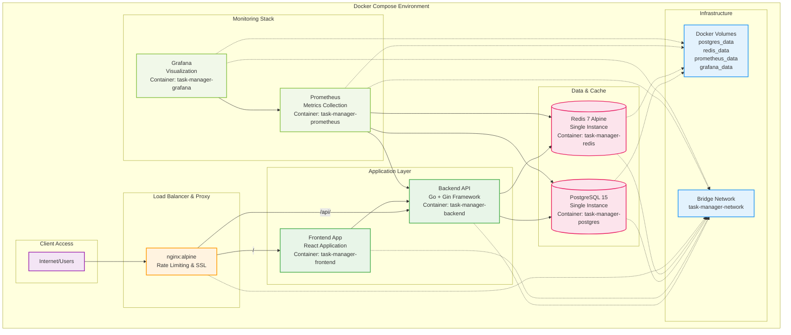

### Scalable Production Configuration

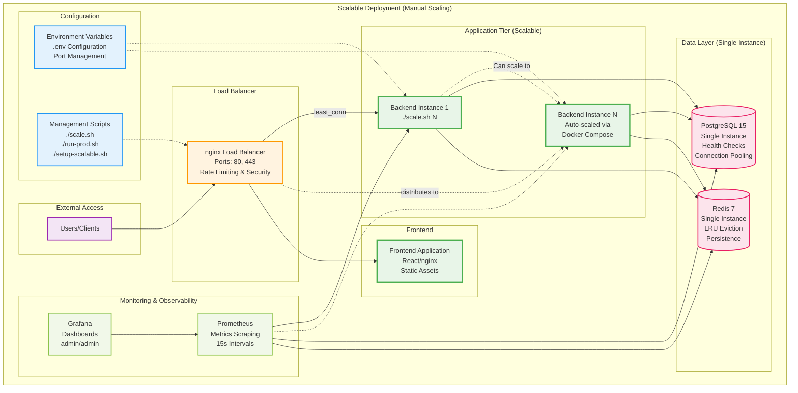

