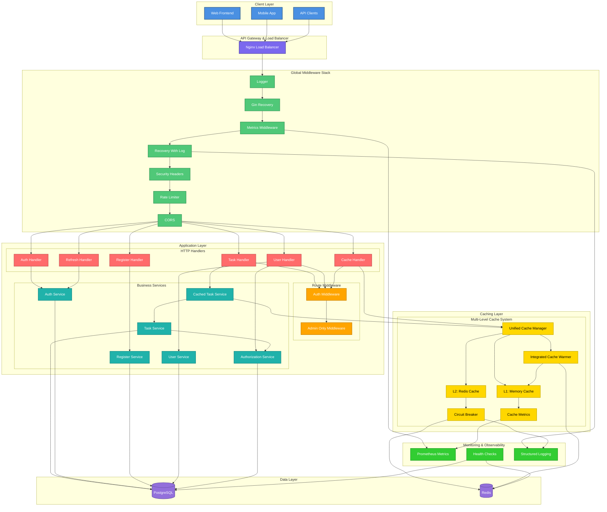
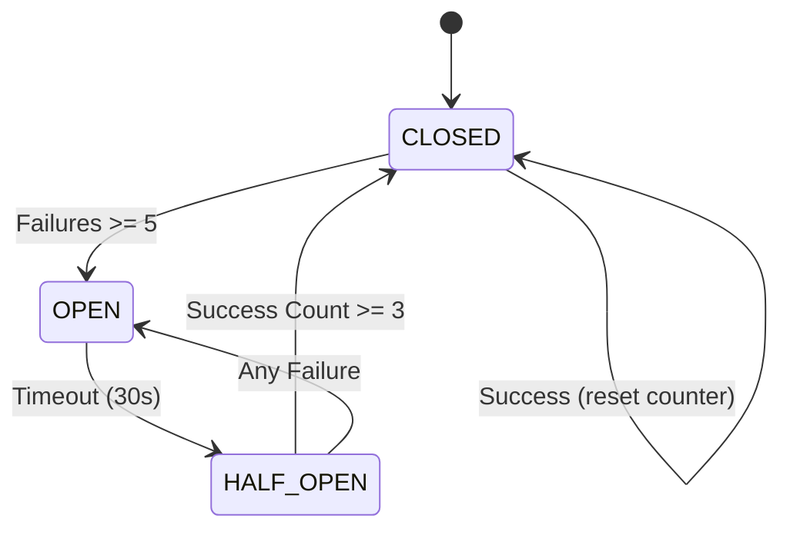
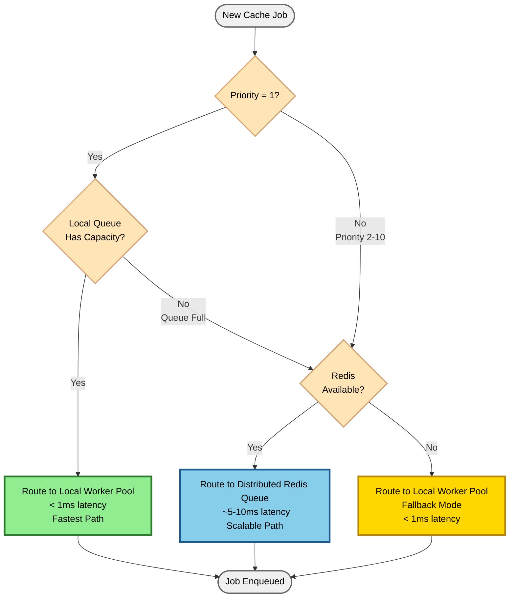
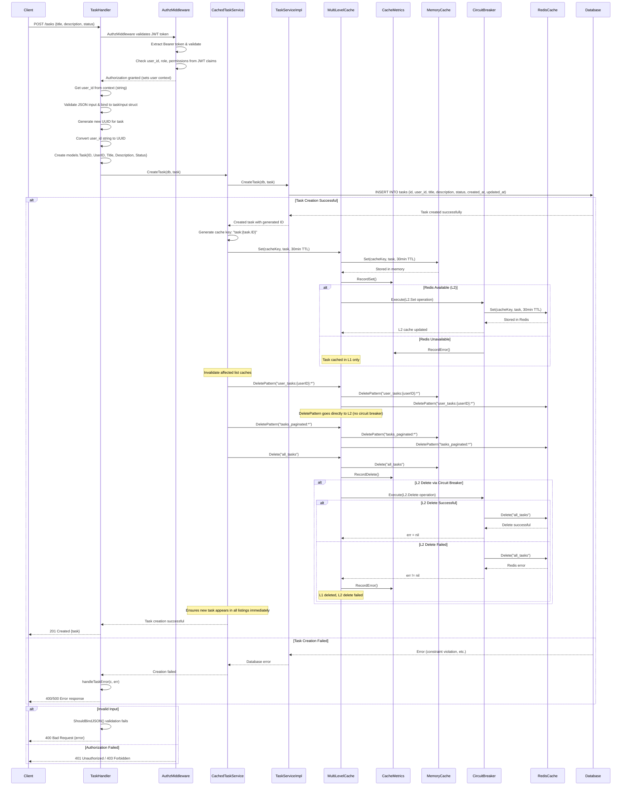
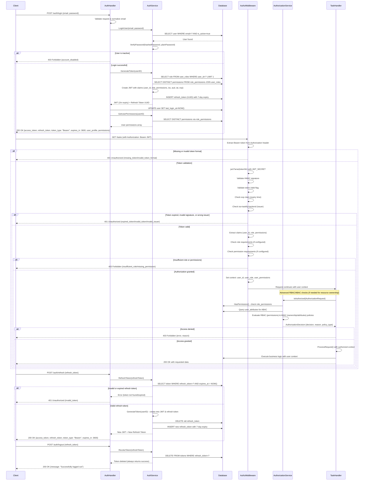
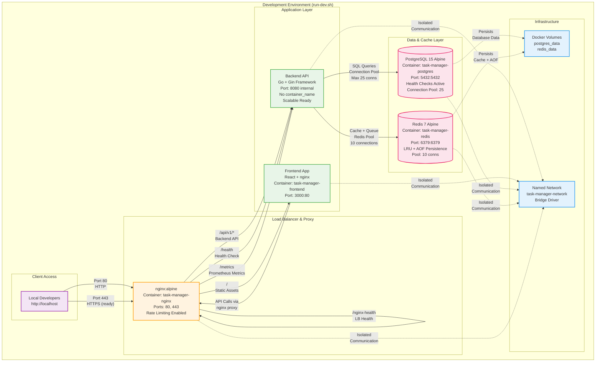
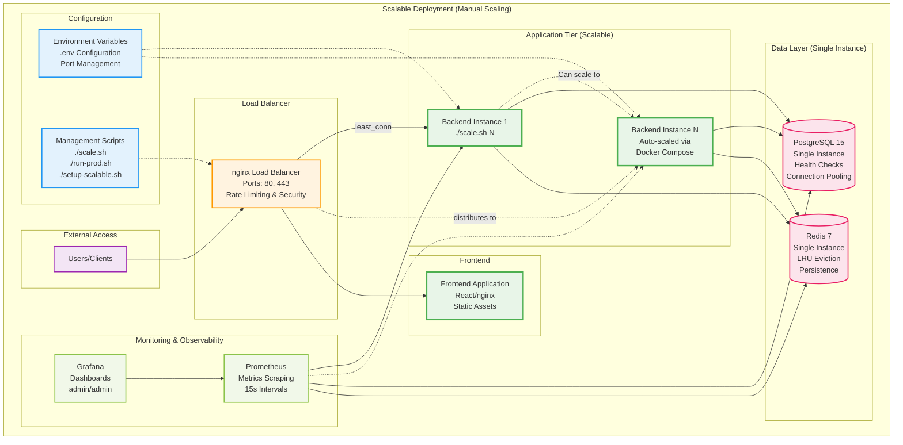

# Task Management API

An enterprise-grade Task Management API, featuring advanced caching, authentication, authorization, and monitoring capabilities. Startar code from [Udacity Taskify : Task Management API](https://github.com/udacity/cd14130-starter/tree/main/starter).

## Software Stack

- **Language**: Go 1.23
- **Web Framework**: Gin
- **Database**: PostgreSQL 15
- **Cache**: Redis 7
- **ORM**: GORM
- **Authentication**: JWT
- **Testing**: Go built-in testing + Testify
- **Containerization**: Docker & Docker Compose
- **Monitoring**: Prometheus & Grafana. 

## Quick Start
### Automated Setup

```bash
git clone https://github.com/polarbeargo/Task-Management-API.git
cd Task-Management-API

./setup-scalable.sh

./run-prod.sh
./test-scaling.sh
```
Details on configuration and environment variables can be found in the [SET_UP&RUN_DEMO.md](SET_UP.md) file.

## System Architecture

### High-Level Architecture Overview



## Class Diagrams

### Core Domain Models


### Service Layer Architecture
A clean, interface-driven design that separates business logic from infrastructure concerns. 
- Advanced Design Patterns
    1. Decorator Pattern ([CachedTaskService](https://github.com/polarbeargo/Task-Management-API/blob/b8202d94082ef756acef656e5f2296c0aaf40ae7/backend/internal/services/cached_tasks.go#L15))
    2. Strategy Pattern ([ABAC Evaluation](https://github.com/polarbeargo/Task-Management-API/blob/b8202d94082ef756acef656e5f2296c0aaf40ae7/backend/internal/services/authorization.go#L192))
    3. Default Composition Over Inheritance 


### Multi-Level Caching System - Multi-Level Intelligence 

- **Cache Interface:**
    - One interface, multiple implementations - clean abstraction for flexibility.
    - **Implementations:**
        - **MemoryCache**: In-memory L1 cache with sync.Map for concurrent access
        - **RedisCache**: Distributed L2 cache with connection pooling
        - **MultiLevelCache**: Composite implementation orchestrating L1 + L2


- The **Circuit Breaker** implements a **Finite State Machine (FSM)** for enterprise reliability and fault tolerance.
    - **Circuit Breaker States:**
        - **Closed**: Normal operation, all requests pass through.
        - **Open**: Redis is down, skip L2 calls for fast-fail.
        - **Half-Open**: Testing recovery, limited calls allowed.  
    - **State Transition Diagram:**



## Cache Warming Job/Worker System
`UnifiedCacheManager` is the brain with [auto-detection logic](https://github.com/polarbeargo/Task-Management-API/blob/07064a662b72e0dc3288d70042c22444ea4f96c3/backend/main.go#L136) that automatically chooses optimal mode based on Redis availability and system configuration.
- Dual-Mode Operation
    - Integrated Mode: Redis + Distributed Workers + Job Routing
    - Legacy Mode: Local Workers + Priority Queues + Fallback Safety


### Cache Job Types: Complete Lifecycle Management
The unified cache management system supports five intelligent job types for cache lifecycle control:

| Job Type | API Function | Priority Range | Description | Use Cases |
|----------|-------------|----------------|-------------|-----------|
| **1. Warmup Jobs** | `EnqueueWarmupJob(key, data, ttl, priority)` | 1-10 (1=immediate) | Core intelligence for individual cache entries with smart TTL management. Priority-based execution with automatic retry logic and linear backoff. | • Pre-load user profiles on login<br/>• Cache critical configuration data<br/>• Warm frequently accessed resources |
| **2. Batch Jobs** | `EnqueueBatchWarmupJob(keys, data, priority)` | 1-10 | Efficiency at scale for bulk operations on related data sets. Atomic processing ensures consistency with reduced network overhead for better performance. | • Cache entire user session data<br/>• Pre-warm product catalog pages<br/>• Bulk import initial data sets |
| **3. Scheduled Jobs** | `EnqueueScheduledWarmup(key, data, ttl, processAt, priority)` | 1-10 | Time-based execution using Unix timestamp scoring. Perfect for cache refresh cycles and maintenance windows with delayed queue management and automatic promotion. | • Scheduled nightly cache refresh<br/>• Pre-warm before traffic spikes<br/>• Periodic data synchronization |
| **4. Validation Jobs** | `EnqueueValidationJob(key, expectedData, priority)` | 1-10 | Data integrity checks against expected values. Cache consistency verification with automatic re-warming when validation fails. Self-healing capabilities for corrupted data. | • Verify critical cache accuracy<br/>• Detect cache corruption<br/>• Ensure data consistency |
| **5. Eviction Jobs** | `EnqueueEvictionJob(key, priority)` | 1-10 | Controlled cache invalidation for outdated data. Pattern-based cleanup for related entries with memory optimization and capacity management. | • Clear user session on logout<br/>• Invalidate stale product data<br/>• Memory pressure management |

**Key Features:**
- **Priority-Based Execution**: Priority 1 executes immediately (high-priority critical data), priority 10 runs in background (low-priority bulk operations)
- **Smart Retry Logic**: Automatic linear backoff for failed operations (1s, 2s, 3s, 4s...)
- **Best-Effort Batch Operations**: Batch jobs process multiple keys efficiently with per-key error handling
- **Pattern Matching**: Eviction supports wildcards (e.g., `user:*`, `session:*`) for related entry cleanup
- **Self-Healing**: Validation jobs automatically re-warm corrupted or missing data
- **Hybrid Processing**: Jobs route intelligently between local in-memory workers (fast) and distributed Redis workers (scalable)
- **Dead Letter Queue**: Failed jobs after max retries (default: 3) move to DLQ for analysis

**Architecture:**
- **5 Distributed Redis Workers**: Process jobs from shared Redis queues (immediate, delayed, DLQ)
- **5 In-Memory Worker Pool**: High-speed local processing for priority 1 jobs
- **Job Router**: Intelligently routes jobs based on priority, queue capacity, and Redis availability
- **Circuit Breaker**: Automatic fallback when Redis is unavailable

### Intelligent Job Routing System

The system uses a **JobRouter** that dynamically routes cache jobs between local in-memory workers and distributed Redis workers based on multiple factors:

#### JobRouter Decision Matrix

The router evaluates jobs in this priority order:

| Priority | Scenario | Routing Decision | Latency | Reason |
|----------|----------|------------------|---------|--------|
| **1st** | **Redis Unavailable** | Local Worker Pool (Fallback) | < 1ms | Graceful degradation, system continues operating without Redis |
| **2nd** | **Scheduled Job Type** | Distributed Redis Queue | ~5-10ms | Time-based execution requires Redis persistence and delayed processing |
| **3rd** | **Priority = 1 (Critical)** | Local Worker Pool | < 1ms | Immediate execution required, bypass network overhead for fastest response |
| **4th** | **Local Queue Full** | Distributed Redis Queue | ~5ms | Prevent blocking when local capacity reached, maintain throughput |
| **5th** | **Normal Priority (2-10)** | Local Worker Pool (Default) | < 1ms | Fast local processing when capacity available, distributed as fallback |

**Routing Logic:**



**Performance Characteristics:**
- **Local Processing**: Sub-millisecond execution, ideal for critical/time-sensitive jobs
- **Distributed Processing**: 5-10ms latency, excellent for normal priority and bulk operations
- **Automatic Failover**: Seamless transition between modes based on system health
- **Load Balancing**: Prevents local worker saturation by offloading to Redis when needed

**The result:** A cache warming system that doesn't just prevent cold starts—it anticipates user needs, scales automatically, and self-heals to deliver consistently exceptional performance across distributed environments. This system represents a paradigm shift from reactive cache management to predictive performance engineering, ensuring our applications maintain lightning-fast response times 24/7.  
## Sequence Diagrams

### Task Creation Flow with Caching



### Task Retrieval with Multi-Level Cache

```mermaid
sequenceDiagram
    participant C as Client
    participant H as TaskHandler
    participant CS as CachedTaskService
    participant MC as MultiLevelCache
    participant M as CacheMetrics
    participant L1 as MemoryCache
    participant CB as CircuitBreaker
    participant L2 as RedisCache
    participant TS as TaskServiceImpl
    participant DB as Database

    C->>H: GET /tasks/:id
    H->>CS: GetTaskByID(db, id)
    
    CS->>CS: Generate cache key: "task:{id}"
    CS->>MC: Get(cacheKey, &cachedTask)
    
    %% L1 Cache Check
    MC->>L1: Get(cacheKey)
    
    alt Cache Hit (L1 Memory)
        L1-->>MC: Task found in memory (raw interface{})
        MC->>MC: copyValue(L1_value, &cachedTask) via JSON marshal/unmarshal
        MC->>M: RecordHit()
        MC-->>CS: Task from L1 memory
        CS-->>H: Cached task
        H-->>C: 200 OK with task
        
    else Cache Miss (L1 Memory)
        L1-->>MC: Not found in memory
        
        alt L2 Redis Available
            MC->>CB: Execute(L2.Get operation with dest)
            
            alt Circuit Breaker CLOSED
                CB->>L2: Get(cacheKey, &cachedTask)
                
                alt Cache Hit (L2 Redis)
                    L2-->>CB: Task found in Redis (JSON unmarshaled into dest)
                    CB-->>MC: err = nil, l2Hit = true
                    note over MC: Data already in dest (&cachedTask)
                    MC->>L1: Set(cacheKey, dest, 5min TTL)
                    note over L1: Promote to L1 with shorter TTL
                    MC->>M: RecordHit()
                    MC-->>CS: Task from L2 Redis (via dest)
                    CS-->>H: Cached task
                    H-->>C: 200 OK with task
                    
                else Cache Miss (L2 Redis)
                    L2-->>CB: ErrCacheMiss
                    CB-->>MC: err = ErrCacheMiss, l2Hit = false
                    MC->>M: RecordMiss()
                    note over MC: Both L1 and L2 miss recorded
                    
                    %% Database Fallback
                    CS->>TS: GetTaskByID(db, id)
                    TS->>DB: SELECT * FROM tasks WHERE id = ?
                    
                    alt Task Found in DB
                        DB-->>TS: Task record
                        TS-->>CS: Fresh task from DB
                        
                        %% Cache the result
                        CS->>MC: Set(cacheKey, task, 30min TTL)
                        MC->>L1: Set(cacheKey, task, 30min TTL)
                        MC->>M: RecordSet()
                        
                        alt Redis Set via Circuit Breaker
                            MC->>CB: Execute(L2.Set operation)
                            
                            alt L2 Set Successful
                                CB->>L2: Set(cacheKey, task, 30min TTL)
                                L2-->>CB: Set successful
                                CB-->>MC: err = nil
                            else L2 Set Failed
                                CB->>L2: Set(cacheKey, task, 30min TTL)
                                L2-->>CB: Redis error
                                CB->>CB: Record failure, may open circuit
                                CB-->>MC: err != nil
                                MC->>M: RecordError()
                                note over MC: L2 set failed but L1 cached
                            end
                        end
                        
                        CS-->>H: Fresh task from DB
                        H-->>C: 200 OK with task
                        
                    else Task Not Found in DB
                        DB-->>TS: Error (gorm.ErrRecordNotFound)
                        TS-->>CS: Error
                        CS-->>H: Error
                        H-->>C: 404 Not Found
                    end
                end
                
            else Circuit Breaker OPEN/HALF-OPEN
                CB-->>MC: Circuit breaker prevents L2 call
                note over CB: Too many Redis failures, circuit OPEN
                
                alt Non-ErrCacheMiss Error
                    CB-->>MC: err != nil && err != ErrCacheMiss
                    MC->>M: RecordError()
                end
                
                MC->>M: RecordMiss()
                
                %% Skip Redis, go directly to DB
                CS->>TS: GetTaskByID(db, id)
                TS->>DB: SELECT * FROM tasks WHERE id = ?
                
                alt Task Found in DB
                    DB-->>TS: Task record
                    TS-->>CS: Fresh task from DB
                    
                    CS->>MC: Set(cacheKey, task, 30min TTL)
                    MC->>L1: Set(cacheKey, task, 30min TTL)
                    note over MC: L2 skipped due to circuit breaker
                    MC->>M: RecordSet()
                    
                    CS-->>H: Fresh task from DB
                    H-->>C: 200 OK with task
                else Task Not Found in DB
                    DB-->>TS: Error (gorm.ErrRecordNotFound)
                    TS-->>CS: Error
                    CS-->>H: Error
                    H-->>C: 404 Not Found
                end
            end
            
        else No Redis (L2 Cache Unavailable)
            MC->>M: RecordMiss()
            note over MC: Only L1 available (no L2 configured)
            
            %% Direct to Database
            CS->>TS: GetTaskByID(db, id)
            TS->>DB: SELECT * FROM tasks WHERE id = ?
            
            alt Task Found in DB
                DB-->>TS: Task record
                TS-->>CS: Fresh task from DB
                
                CS->>MC: Set(cacheKey, task, 30min TTL)
                MC->>L1: Set(cacheKey, task, 30min TTL)
                MC->>M: RecordSet()
                
                CS-->>H: Fresh task from DB
                H-->>C: 200 OK with task
            else Task Not Found in DB
                DB-->>TS: Error (gorm.ErrRecordNotFound)
                TS-->>CS: Error
                CS-->>H: Error
                H-->>C: 404 Not Found
            end
        end
    end

    %% Cache Invalidation (on Update/Delete)
    note over CS: Cache Invalidation Strategy
    C->>H: PUT /tasks/:id (update task)
    H->>CS: UpdateTask(db, id, updated)
    CS->>TS: UpdateTask(db, id, updated)
    TS->>DB: UPDATE tasks SET ... WHERE id = ?
    
    %% Invalidate specific task cache
    CS->>MC: Delete("task:{id}")
    MC->>L1: Delete("task:{id}")
    MC->>CB: Execute(L2.Delete operation)
    CB->>L2: Delete("task:{id}")
    
    %% Invalidate related caches
    CS->>MC: DeletePattern("user_tasks:{userID}:*")
    CS->>MC: DeletePattern("tasks_paginated:*")
    CS->>MC: Delete("all_tasks")
    
    CS-->>H: Update successful
    H-->>C: 200 OK

    %% Cache Management (on Create)
    note over CS: Create Task with Cache Management
    C->>H: POST /tasks (create task)
    H->>CS: CreateTask(db, task)
    CS->>TS: CreateTask(db, task)
    TS->>DB: INSERT INTO tasks ...
    DB-->>TS: Task created
    TS-->>CS: Created task
    
    %% Cache the new task immediately
    CS->>MC: Set("task:{id}", task, 30min TTL)
    MC->>L1: Set("task:{id}", task, 30min TTL)
    MC->>M: RecordSet()
    
    alt Redis Available
        MC->>CB: Execute(L2.Set operation)
        CB->>L2: Set("task:{id}", task, 30min TTL)
        L2-->>CB: Set successful
        CB-->>MC: Redis cache updated
    else Redis Unavailable
        note over MC: Only cached in L1 memory
    end
    
    %% Invalidate related list caches (FIXED)
    CS->>MC: DeletePattern("user_tasks:{userID}:*")
    CS->>MC: DeletePattern("tasks_paginated:*")
    CS->>MC: Delete("all_tasks")
    note over CS: Ensures new task appears in all listings
    
    CS-->>H: Create successful
    H-->>C: 201 Created with task

    %% Cache Invalidation (on Delete)
    note over CS: Delete Task with Cache Cleanup
    C->>H: DELETE /tasks/:id
    H->>CS: DeleteTask(db, id)
    CS->>TS: GetTaskByID(db, id) for userID
    TS->>DB: SELECT * FROM tasks WHERE id = ?
    DB-->>TS: Task details (for cleanup)
    TS-->>CS: Task info
    
    CS->>TS: DeleteTask(db, id)
    TS->>DB: DELETE FROM tasks WHERE id = ?
    DB-->>TS: Task deleted
    TS-->>CS: Delete successful
    
    %% Complete cache cleanup
    CS->>MC: Delete("task:{id}")
    MC->>L1: Delete("task:{id}")
    MC->>CB: Execute(L2.Delete operation)
    CB->>L2: Delete("task:{id}")
    
    CS->>MC: DeletePattern("user_tasks:{userID}:*")
    CS->>MC: DeletePattern("tasks_paginated:*")
    CS->>MC: Delete("all_tasks")
    
    CS-->>H: Delete successful
    H-->>C: 204 No Content
```



### Authentication & Authorization Flow



### Job/Worker Sequence Flow

```mermaid
sequenceDiagram
    participant C as Client/Application
    participant UCM as UnifiedCacheManager
    participant ICW as IntegratedCacheWarmer
    participant JR as JobRouter
    participant DCW as DistributedCacheWorker
    participant WP as WorkerPool
    participant W as Worker Goroutine
    participant RC as ResultCollector
    participant JS as JobScheduler
    participant PQ as PriorityQueue
    participant Redis as Redis Queue
    participant Cache as Cache

    %% Initialization Phase
    C->>UCM: NewUnifiedCacheManager(cache, config)
    UCM->>UCM: determineMode(config)
    note over UCM: Pings Redis to test availability
    
    alt Integrated Mode (Redis Available)
        UCM->>ICW: NewIntegratedCacheWarmer(cache, redisClient, strategy)
        ICW->>ICW: Create JobRouter inline (redisAvailable, localCapacity, distributedQueue)
        ICW->>WP: NewWorkerPool(workers, cache)
        ICW->>ICW: Create legacy CacheWarmer for scheduler
        ICW->>JS: NewJobScheduler(legacyWarmer, workerPool)
        ICW->>PQ: NewPriorityQueue()
        
        alt Redis Client Provided
            ICW->>Redis: Ping(ctx) with 2s timeout
            alt Redis Ping Success
                ICW->>JR: Set redisAvailable = true
                note over ICW: Redis available for distributed processing
            else Redis Ping Failed
                ICW->>JR: Set redisAvailable = false
                note over ICW: Falls back to local-only mode
            end
        else No Redis Client
            ICW->>JR: Set redisAvailable = false
        end
        
        note over ICW: Distributed workers NOT created yet (created in Start)
    else Legacy Mode (Redis Unavailable)
        UCM->>CW: NewCacheWarmer(cache, strategy)
        note over UCM: Falls back to legacy in-memory system
    end

    %% Startup Phase
    C->>UCM: Start()
    UCM->>ICW: Start()
    
    ICW->>WP: Start()
    loop Worker Initialization
        WP->>W: Start worker(id) goroutine
        W->>W: Listen on jobCh channel
        note over W: Worker waits for jobs
    end
    
    WP->>RC: Start resultCollector() goroutine
    note over RC: Collects job results and updates metrics
    
    alt Redis Available (jobRouter.redisAvailable)
        loop Create Distributed Workers (strategy.ConcurrentJobs)
            ICW->>DCW: Create DistributedCacheWorker{id, warmer, redisClient, queueName}
            ICW->>DCW: start() - launch goroutine
            DCW->>DCW: Start polling loop with 100ms ticker
            note over DCW: Polls Redis queues every 100ms
        end
        note over ICW: Started N distributed cache workers
    else Redis Unavailable
        note over ICW: Skip distributed worker creation (local-only mode)
    end
    
    alt Scheduler Enabled
        ICW->>JS: Start()
        JS->>JS: Start schedulerLoop()
    end

    %% Job Enqueue Phase
    C->>UCM: EnqueueWarmupJob(key, data, ttl, priority)
    UCM->>ICW: EnqueueWarmupJob(key, data, ttl, priority)
    ICW->>ICW: Create DistributedCacheJob{ID, Type, Payload, Priority, MaxTries}
    ICW->>ICW: routeJob(job) - Check routing conditions
    
    alt Case 1: Redis Unavailable (!redisAvailable)
        note over ICW: Redis not available, route to local
        ICW->>ICW: localJobs++
        ICW->>ICW: enqueueToLocal(job)
        ICW->>ICW: Convert DistributedCacheJob to WarmupJob
        ICW->>WP: SubmitJob(warmupJob)
        WP->>W: Send job via jobCh
        W->>W: processJob(job)
        W->>Cache: Set(key, data, TTL)
        Cache-->>W: Success/Error
        W->>RC: Send JobResult via resultCh
        RC->>WP: Update metrics (jobsProcessed, errors)
        
    else Case 2: Scheduled Job (Type == CacheJobScheduled)
        note over ICW: Scheduled jobs always go to distributed
        ICW->>ICW: distributedJobs++
        ICW->>ICW: enqueueToRedis(job)
        ICW->>Redis: ZAdd(cache_jobs, prioritizedJob)
        note over ICW: Score = now.Unix() - priority
        Redis-->>ICW: Job queued
        
    else Case 3: High Priority Job (priority == 1)
        note over ICW: High priority goes to local for fast processing
        ICW->>ICW: localJobs++
        ICW->>ICW: enqueueToLocal(job)
        ICW->>ICW: Convert DistributedCacheJob to WarmupJob
        ICW->>WP: SubmitJob(warmupJob)
        WP->>W: Send job via jobCh
        W->>W: processJob(job)
        W->>Cache: Set(key, data, TTL)
        Cache-->>W: Success/Error
        W->>RC: Send JobResult via resultCh
        RC->>WP: Update metrics (jobsProcessed, errors)
        
    else Case 4: Local Queue Full (len(jobCh) > ConcurrentJobs)
        note over ICW: Local queue full, overflow to distributed
        ICW->>ICW: distributedJobs++
        ICW->>ICW: enqueueToRedis(job)
        ICW->>Redis: ZAdd(cache_jobs, prioritizedJob)
        Redis-->>ICW: Job queued
        
    else Case 5: Default (Normal Priority, Queue Available)
        note over ICW: Normal priority with space, prefer local
        ICW->>ICW: localJobs++
        ICW->>ICW: enqueueToLocal(job)
        ICW->>ICW: Convert DistributedCacheJob to WarmupJob
        ICW->>WP: SubmitJob(warmupJob)
        WP->>W: Send job via jobCh
        W->>W: processJob(job)
        W->>Cache: Set(key, data, TTL)
        Cache-->>W: Success/Error
        W->>RC: Send JobResult via resultCh
        RC->>WP: Update metrics (jobsProcessed, errors)
    end
    
    %% Distributed Processing Loop (for jobs routed to Redis)
    loop Distributed Worker Polling (every 100ms)
        DCW->>DCW: processJobs() - Called by ticker
        DCW->>DCW: moveDelayedJobs(ctx)
        DCW->>Redis: ZRangeByScore(cache_jobs_delayed, "-inf", now, Count:10)
        Redis-->>DCW: Ready delayed jobs (up to 10)
        
        loop For each ready delayed job
            DCW->>Redis: ZRem(cache_jobs_delayed, jobData)
            note over DCW: Calculate score = now.Unix() - priority
            DCW->>Redis: ZAdd(cache_jobs, jobData, score)
        end
        
        DCW->>DCW: processImmediateJobs(ctx)
        DCW->>Redis: ZPopMin(cache_jobs) - Get highest priority job
        Redis-->>DCW: Next priority job (lowest score = highest priority)
        
        alt Job Retrieved
            DCW->>DCW: executeJob(job)
            note over DCW: Increment job.Attempts
            
            alt Job Type: Warmup or Scheduled (CacheJobWarmup, CacheJobScheduled)
                DCW->>DCW: handleWarmupJob(job)
                DCW->>Cache: Set(key, data, TTL)
            else Job Type: Batch (CacheJobBatch)
                DCW->>DCW: handleBatchJob(job)
                loop For each key in batch
                    DCW->>Cache: Set(key, data, TTL)
                end
            else Job Type: Validation (CacheJobValidation)
                DCW->>DCW: handleValidationJob(job)
                DCW->>Cache: Exists(key)
                alt Validation Fails
                    DCW->>ICW: Re-enqueue warmup job
                end
            else Job Type: Eviction (CacheJobEviction)
                DCW->>DCW: handleEvictionJob(job)
                DCW->>Cache: Delete(key)
            end
            
            Cache-->>DCW: Operation result
            
            alt Job Success
                DCW->>ICW: Increment processedJobs
                note over DCW: Log: job completed successfully
            else Job Failure
                DCW->>ICW: Increment failedJobs
                note over DCW: Log: job failed with error
                
                alt Retries Available (attempts < maxTries)
                    DCW->>DCW: Calculate retry delay (attempts * 1 second)
                    DCW->>DCW: Set job.ProcessAt = now + retryDelay
                    DCW->>Redis: ZAdd(cache_jobs_delayed, retryJob)
                    note over DCW: Score = ProcessAt.Unix()
                    DCW->>ICW: Increment retryJobs
                    note over DCW: Linear backoff: delay = attempts * 1 second
                else Max Retries Exceeded
                    DCW->>Redis: LPush(cache_jobs_dlq, failedJob)
                    note over DCW: Move to dead letter queue (DLQ)
                end
            end
        end
    end

    %% Scheduled Job Processing
    C->>UCM: EnqueueScheduledWarmup(key, data, ttl, processAt, priority)
    UCM->>ICW: EnqueueScheduledWarmup(...)
    ICW->>ICW: Create DistributedCacheJob{Type: CacheJobScheduled}
    
    alt Redis Available (redisAvailable)
        ICW->>ICW: Check if processAt is in future
        
        alt Future Job (processAt > now)
            ICW->>Redis: ZAdd(cache_jobs_delayed, scheduledJob)
            note over ICW: Score = processAt.Unix()
        else Immediate Job (processAt <= now)
            ICW->>Redis: ZAdd(cache_jobs, immediateJob)
            note over ICW: Score = now.Unix() - priority
        end
    else Redis Unavailable
        note over ICW: Log warning: "Redis unavailable for scheduled job, executing immediately"
        ICW->>ICW: enqueueToLocal(job)
        ICW->>WP: SubmitJob(warmupJob)
        WP->>W: Process immediately via jobCh
    end

    %% Batch Job Processing
    C->>UCM: EnqueueBatchWarmupJob(keys, data, priority)
    UCM->>ICW: EnqueueBatchWarmupJob(...)
    ICW->>ICW: Create DistributedCacheJob{Type: CacheJobBatch}
    ICW->>ICW: routeJob(batchJob) - Apply routing logic
    
    alt Routed to Local (priority==1 OR queue available OR Redis unavailable)
        ICW->>ICW: enqueueToLocal(job)
        note over ICW: Convert batch job to multiple WarmupJobs
        
        loop For each key in batch
            ICW->>ICW: Create WarmupJob{key, data, ttl, priority}
            ICW->>WP: SubmitJob(warmupJob)
        end
        
        par Concurrent Batch Processing
            WP->>W: Process job for key1 via jobCh
            W->>Cache: Set(key1, data, TTL)
        and
            WP->>W: Process job for key2 via jobCh
            W->>Cache: Set(key2, data, TTL)
        and
            WP->>W: Process job for key3 via jobCh
            W->>Cache: Set(key3, data, TTL)
        end
        
        loop Collect Results
            W->>RC: Send JobResult via resultCh
            RC->>WP: Update batch metrics
        end
        
    else Routed to Distributed (queue full OR normal priority)
        ICW->>ICW: enqueueToRedis(job)
        ICW->>Redis: ZAdd(cache_jobs, batchJob)
        note over ICW: Single batch job queued for distributed processing
        
        DCW->>Redis: ZPopMin(cache_jobs)
        DCW->>DCW: executeJob(batchJob)
        DCW->>DCW: handleBatchJob(job)
        
        loop For each key sequentially
            DCW->>Cache: Set(key, data, TTL)
        end
    end

    %% Metrics & Monitoring
    C->>UCM: GetMetrics()
    UCM->>ICW: GetMetrics()
    
    par Collect Metrics
        ICW->>WP: GetStats()
        WP-->>ICW: Local worker stats (jobsProcessed, errors, totalDuration)
    and
        ICW->>JS: GetStats()
        JS-->>ICW: Scheduler stats
    and
        ICW->>PQ: Len()
        PQ-->>ICW: Queue sizes
    and
        ICW->>Redis: ZCard operations on all queues
        Redis-->>ICW: Distributed queue metrics (immediate, delayed, dlq)
    end
    
    ICW-->>UCM: Comprehensive metrics
    UCM-->>C: Unified metrics response

    %% Health Check
    C->>UCM: HealthCheck()
    UCM->>ICW: HealthCheck()
    
    par Health Checks
        ICW->>Redis: Ping() with 2s timeout
        Redis-->>ICW: Connection status
    and
        ICW->>WP: IsRunning()
        WP-->>ICW: Worker pool status
    and
        ICW->>JS: IsRunning()
        JS-->>ICW: Scheduler status
    end
    
    ICW-->>UCM: Health status with Redis connectivity
    UCM-->>C: Overall system health```
    UCM-->>C: System health report

    %% Graceful Shutdown
    C->>UCM: Stop()
    UCM->>ICW: Stop()
    
    ICW->>JS: Stop()
    JS->>JS: Cancel context & stop loops
    
    loop For each distributed worker
        ICW->>DCW: Close stopCh
        DCW->>DCW: Complete current job & exit
    end
    
    ICW->>WP: Stop()
    WP->>WP: Close jobCh
    loop For each worker
        WP->>W: Workers receive shutdown signal
        W->>W: Complete current job & exit
    end
    WP->>WP: Wait for all workers (wg.Wait())
    
    ICW->>ICW: Close stopCh & cleanup
    
    note over UCM,Cache: All components gracefully shut down
```


## Deployment Architecture

### Development Configuration (`run-dev.sh`)

**Production-like development environment using scalable architecture - for local development with nginx load balancer.**

This configuration uses `docker-compose.scalable.yml` but starts only core services (postgres, redis, backend, frontend, nginx), excluding monitoring (Prometheus/Grafana) for faster startup.



---

### Scalable Production Configuration

- This configuration is designed for production workloads with dynamic scaling capabilities, load balancing, and comprehensive monitoring. The backend can be scaled to multiple instances without code changes or configuration updates.  



**Scaling Behavior:**
- **Automatic Service Discovery**: New instances automatically join the nginx upstream pool
- **Session-Independent**: JWT-based stateless authentication supports any backend instance
- **Shared Data Layer**: All backends connect to single PostgreSQL and Redis instances
- **Cache Coherence**: Redis L2 cache synchronized across all backend instances

**Performance Characteristics:**
| Metric | Single Instance | 3 Instances | 5 Instances |
|--------|----------------|-------------|-------------|
| **Max Throughput** | ~500 req/s | ~1,500 req/s | ~2,500 req/s |
| **Concurrent Users** | ~100 | ~300 | ~500 |
| **Failover Time** | N/A (single point of failure) | <1 second | <1 second |
| **CPU Utilization** | High | Balanced | Optimal |

**Use Cases:**
- Production environments with >100 concurrent users
- Applications requiring high availability (99.9% uptime SLA)
- Traffic spike handling (e.g., Black Friday, product launches)
- Blue-green and canary deployments
- Kubernetes-ready architecture (easy migration path)


---
