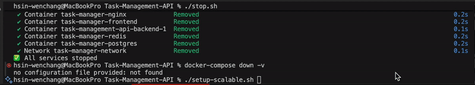
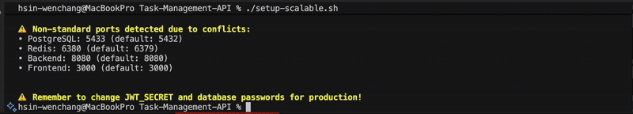
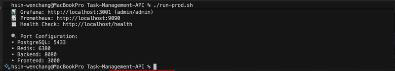
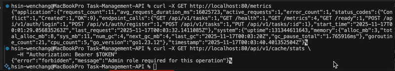
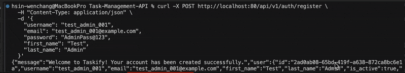
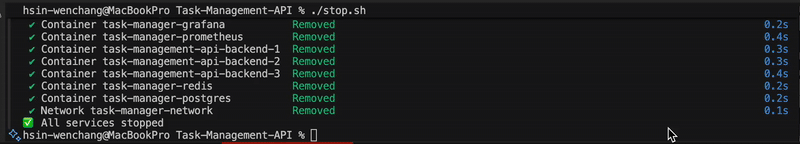

# Task Management API - Setup Guide

## Prerequisites

Before running this project, ensure you have:

- **Docker** (v20.0+) and **Docker Compose** (v2.0+)
- **Go** (v1.23+) - for local development
- **Git** - for cloning the repository

## Getting Started

### Alternative Setup Scripts
Eight utility scripts for common operations:

| Script                 | Purpose                          |
|------------------------|----------------------------------|
| `./setup-scalable.sh`  | Initial setup with .env creation |
| `./run-dev.sh`         | Start development environment    |
| `./run-prod.sh`        | Start production environment     |
| `./scale.sh N`         | Scale backend to N instances     |
| `./stop.sh`            | Graceful shutdown                |
| `./test-scaling.sh`    | Automated testing suite          |
| `./admin-cache-test.sh` | Admin cache testing script       |
| `./api-test.sh`         | API functionality testing script |

For production-ready deployment with scalable infrastructure:

**Setup with scalable caching:**
```bash
./setup-scalable.sh
```


This script sets up:
- Multi-level caching (Memory L1 + Redis L2)
- Distributed Redis workers (5 workers)
- In-memory worker pools (5 workers)
- Integrated cache warmer with graceful shutdown
- Production-optimized configurations

**Run in production mode:**
```bash
./run-prod.sh
```


This script starts the application with:
- Production environment settings
- Optimized performance configurations
- All scalability features enabled
- Complete monitoring and metrics

### Production-Ready Features

- **Multi-level caching:** Memory L1 + Redis L2 with distributed cache warming
- **Graceful shutdown:** 30s timeout for in-flight requests
- **Health checks:** `/health` and `/ready` endpoints for load balancers
- **Prometheus metrics:** Comprehensive application metrics at `/metrics`
- **Rate limiting:** 100 req/min per IP (configurable)
- **Database connection pooling:** Optimized for high concurrency
- **JWT authentication:** Secure tokens with 15-minute expiry + refresh tokens
- **RBAC/ABAC authorization:** Fine-grained access control
- **Environment-based config:** Easy deployment across environments
- **Docker & Kubernetes ready:** Production-grade containerization
- **Auto-migrations:** Database schema migrations run automatically on startup
- **Redis distributed workers:** 5 concurrent cache warming workers
- **Batch job processing:** Efficient bulk operations

**Important Configuration:**
- Backend APIs accessible via Nginx Port 80
- PostgreSQL uses named volume for data persistence
- Redis connection via `redis:6379` (Docker service name)
- All API endpoints versioned with `/api/v1/` prefix

**Monitoring URLs:**
- Grafana Dashboard: http://localhost:3001 (admin/admin)
- Prometheus: http://localhost:9090
- Application: http://localhost

**Stop all:**
```bash
./stop.sh
```
### Start with Docker Compose

Another way to run the entire application stack:

```bash
# Start all services
docker-compose -f docker-compose.scalable.yml up -d

# Check status
docker-compose -f docker-compose.scalable.yml ps

# View logs
docker-compose -f docker-compose.scalable.yml logs -f backend
```

**Access URLs:**
- Frontend: http://localhost
- Backend API: http://localhost/api/v1
- Health Check: http://localhost/api/v1/health
- Readiness Check: http://localhost/api/v1/ready
- Prometheus Metrics: http://localhost/api/v1/metrics
- Cache Stats: http://localhost/api/v1/cache/stats (requires auth)

**Stop services:**
```bash
docker-compose -f docker-compose.scalable.yml down
```

**Complete reset (removes all data):**
```bash
docker-compose -f docker-compose.scalable.yml down -v
docker-compose -f docker-compose.scalable.yml up -d 
```

## API Testing Examples

### Authentication

Register a new user:
```bash
curl -X POST http://localhost:80/api/v1/auth/register \
  -H "Content-Type: application/json" \
  -d '{
    "username": "john_doe",
    "email": "john@example.com",
    "password": "SecurePass@123",
    "first_name": "John",
    "last_name": "Doe"
  }'
```

**Registration Requirements:**
- `username`: Required, 3-50 characters, alphanumeric and underscores
- `email`: Required, must be valid email format and unique
- `password`: Required, minimum 8 characters with uppercase, lowercase, number, and special character
- `first_name`: Required
- `last_name`: Required

**Success Response (201 Created):**
```json
{
  "message": "Welcome to Taskify! Your account has been created successfully.",
  "user": {
    "id": "uuid-here",
    "username": "john_doe",
    "email": "john@example.com",
    "first_name": "John",
    "last_name": "Doe",
    "is_active": true,
    "role": "user"
  }
}
```

Login to get JWT token:
```bash
curl -X POST http://localhost:80/api/v1/auth/login \
  -H "Content-Type: application/json" \
  -d '{
    "email": "john@example.com",
    "password": "SecurePass@123"
  }'
```

**Note:** Login requires `email` (not `username`) and `password`.

**Success Response (200 OK):**
```json
{
  "access_token": "eyJhbGci...",
  "refresh_token": "uuid-here",
  "token_type": "Bearer",
  "expires_in": 3600,
  "user": {
    "id": "uuid-here",
    "email": "john@example.com",
    "first_name": "John",
    "last_name": "Doe",
    "is_active": true,
    "last_login_at": "2025-11-17T00:00:00Z"
  },
  "permissions": [
    "profile:read",
    "profile:update",
    "task:create",
    "task:read",
    "task:update",
    "task:delete"
  ]
}
```

**Response Fields:**
- `access_token`: JWT token for authentication (expires in 24 hours by default)
- `refresh_token`: Use to get a new access token without re-login
- `expires_in`: Token expiry time in seconds
- `permissions`: List of permissions granted to the user based on their role

**Refresh Token:**
```bash
curl -X POST http://localhost:80/api/v1/auth/refresh \
  -H "Content-Type: application/json" \
  -d '{
    "refresh_token": "your-refresh-token-here"
  }'
```

Run test script:

```bash
./api-test.sh
```

### Task Operations

```bash
TOKEN="your_jwt_token_here"

# Create task
curl -X POST http://localhost:80/api/v1/tasks \
  -H "Authorization: Bearer $TOKEN" \
  -H "Content-Type: application/json" \
  -d '{"title": "Complete docs", "description": "Finish all documentation", "status": "pending"}'

# Get all tasks
curl -X GET http://localhost:80/api/v1/tasks \
  -H "Authorization: Bearer $TOKEN"

# Update task
curl -X PUT http://localhost:80/api/v1/tasks/{task_id} \
  -H "Authorization: Bearer $TOKEN" \
  -H "Content-Type: application/json" \
  -d '{"status": "in_progress"}'
```


### Health Checks

```bash
# Health check
curl -X GET http://localhost:80/health

# Readiness check
curl -X GET http://localhost:80/ready

# Prometheus metrics
curl -X GET http://localhost:80/metrics
```

## Administrative Actions

### Admin User Setup

First, create an admin user or use the default admin from migrations:

**Option 1: Create New Admin User**
```bash
# Step 1: Register the user
curl -X POST http://localhost:80/api/v1/auth/register \
  -H "Content-Type: application/json" \
  -d '{
    "username": "test_admin_001",
    "email": "test_admin_001@example.com",
    "password": "AdminPass@123",
    "first_name": "Test",
    "last_name": "Admin"
  }'

# Step 2: Promote to admin role (requires database access)
docker exec -it task-manager-postgres psql -U postgres -d task_manager -c \
  "INSERT INTO user_roles (user_id, role_id) 
   SELECT u.id, '00000000-0000-0000-0000-000000000002' 
   FROM users u 
   WHERE u.email = 'test_admin_001@example.com';"
```

**Option 2: Use Default Admin** (email: `admin@example.com`)
- Check the database for the current password or reset it via migrations

### Cache Management

**Get Admin Token:**
```bash
TOKEN=$(curl -s -X POST http://localhost:80/api/v1/auth/login \
  -H "Content-Type: application/json" \
  -d '{"email":"test_admin_001@example.com","password":"AdminPass@123"}' \
  | jq -r '.access_token')

echo "Token: $TOKEN"
```

**Verify Admin Permissions:**
```bash
curl -s -X POST http://localhost:80/api/v1/auth/login \
  -H "Content-Type: application/json" \
  -d '{"email":"test_admin_001@example.com","password":"AdminPass@123"}' \
  | jq '.permissions'
```

Expected permissions should include: `system:admin`, `audit:read`, `role:manage`

**Cache Operations:**

```bash
# Get cache statistics and metrics
curl -X GET http://localhost:80/api/v1/cache/stats \
  -H "Authorization: Bearer $TOKEN" | jq .

# Get cache system health
curl -X GET http://localhost:80/api/v1/cache/health \
  -H "Authorization: Bearer $TOKEN"

# Trigger immediate cache warming
curl -X POST http://localhost:80/api/v1/cache/warm \
  -H "Authorization: Bearer $TOKEN"

# Enqueue a warmup job
curl -X POST http://localhost:80/api/v1/cache/jobs/warmup \
  -H "Authorization: Bearer $TOKEN" \
  -H "Content-Type: application/json" \
  -d '{
    "key": "user:123",
    "data": {"name": "John Doe"},
    "ttl": 900000000000,
    "priority": 5
  }'

# Enqueue batch warmup job
curl -X POST http://localhost:80/api/v1/cache/jobs/batch \
  -H "Authorization: Bearer $TOKEN" \
  -H "Content-Type: application/json" \
  -d '{
    "keys": ["user:1", "user:2", "user:3"],
    "data": {},
    "priority": 5
  }'

# Schedule a warmup job for future execution
curl -X POST http://localhost:80/api/v1/cache/jobs/scheduled \
  -H "Authorization: Bearer $TOKEN" \
  -H "Content-Type: application/json" \
  -d '{
    "key": "task:popular",
    "data": {},
    "ttl": 900000000000,
    "process_at": "2025-11-09T10:00:00Z",
    "priority": 3
  }'

# Evict a specific cache key
curl -X DELETE http://localhost:80/api/v1/cache/jobs/evict/user:123 \
  -H "Authorization: Bearer $TOKEN"

# Evict cache keys by pattern (wildcard)
curl -X DELETE http://localhost:80/api/v1/cache/jobs/evict/user:\* \
  -H "Authorization: Bearer $TOKEN"

# Clear cache
curl -X DELETE http://localhost:80/api/v1/cache/clear \
  -H "Authorization: Bearer $TOKEN"
```

  

Run test script:
```bash
./admin-cache-test.sh
```

. 

Run the comprehensive scaling test:

```bash
./test-scaling.sh
```


## Local Development

### Backend

```bash
cp .env.example .env
cd backend
go mod download
go run main.go
```

### Frontend

```bash
cd frontend
npm install
npm start
```

## Testing

```bash
cd backend
go test ./... -v
go test ./... -cover
```

## Monitoring

```bash
# View logs
docker-compose logs -f backend

# Database access
docker-compose exec postgres-db psql -U postgres -d task_manager

# Redis access
docker-compose exec redis redis-cli
```

## Troubleshooting

### Common Issues

**Database Connection Failed:**
- Wait for PostgreSQL to be healthy (takes ~10 seconds on first start)

**Password validation:**
Ensure 8+ chars with uppercase, lowercase, special char, and number

**Authentication failed:**
Check token expiry (1 hour default) and proper Bearer header format

```bash
# Check what's using a port
lsof -i :8080
```

**Backend Build Failures:**
Check Go model/database schema mismatches in logs

## API Reference

### Public Endpoints

| Method | Endpoint | Description |
|--------|----------|-------------|
| GET | `/health` | Health check |
| GET | `/ready` | Readiness probe |
| GET | `/metrics` | Prometheus metrics |
| POST | `/api/v1/auth/register` | Register user |
| POST | `/api/v1/auth/login` | Login |
| POST | `/api/v1/auth/refresh` | Refresh token |

### Protected Endpoints (Require Authentication)

**Tasks:**
- POST `/api/v1/tasks` - Create task
- GET `/api/v1/tasks` - Get all tasks
- GET `/api/v1/tasks/:id` - Get task by ID
- PUT `/api/v1/tasks/:id` - Update task
- DELETE `/api/v1/tasks/:id` - Delete task

**Users:**
- GET `/api/v1/users/profile` - Get profile
- PUT `/api/v1/users/profile` - Update profile
- GET `/api/v1/users` - Get all users (admin)

**Cache (Admin):**
- GET `/api/v1/cache/stats` - Cache statistics and metrics
- GET `/api/v1/cache/health` - Cache system health check
- POST `/api/v1/cache/warm` - Trigger immediate cache warming
- DELETE `/api/v1/cache/clear` - Clear all cache
- POST `/api/v1/cache/jobs/warmup` - Enqueue cache warmup job
- POST `/api/v1/cache/jobs/batch` - Enqueue batch warmup job
- POST `/api/v1/cache/jobs/scheduled` - Schedule future warmup job
- DELETE `/api/v1/cache/jobs/evict/:key` - Evict specific cache key or pattern
---
